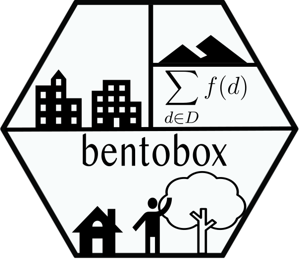

#  `bentobox`: Built Environment Network objects ToolBox


## About

Inspired by the `tidyverse`'s package ecosystem that work together 
cohesively for day-to-day analysis, the `bentobox` package is intended to 
provide a wide range of data structures and modeling techniques for those
working with built environment data. 
The `bentobox` contains the following packages

* `rbenvo` for creating and working with subject - built environment relational data.
* `rsstap` for estimating population level effects of built environment exposure on pertinent health outcomes.
* `bendr` for estimating clusters of spatial distributions between subjects and point pattern built environment features. 
* `rstapDP` for estimating heterogeneous - cluster level effects of built environment exposure on pertinent health outcomes.


## Installation

### Development Version

 Currently this package is only available via Github. It is in active development and thus caution is warraranted to anyone interested in using it.
 In order to install the software use the following lines of R code

 ```r
 if(!require(devtools)){
	install.packages("devtools")
	library(devtools)
 }

install_github("apeterson91/bentobox",dependencies = TRUE)
 ```

## Acknowledgments

This work was developed with support from NIH grant R01-HL131610 (PI: Sanchez).
